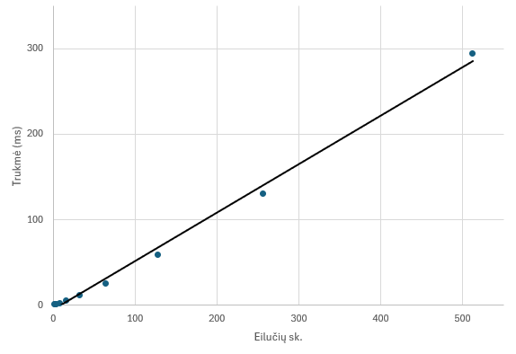

# Hash funkcija

# Versija v0.2
## Pseudo-kodas

### myhash(input)

```
Inicializuojamos konstantos:
blockSize=64;
targetHashSize=64;
Pradedamas pats hash'inimas:
binary=stobinary(input)
Pad'inama, kad binary sudarytų 512 bitų kartotinis skaičius simbolių
Inicializuojamas bitset<256> finalHash;
Toliau dirbama su kiekvienu 512 bitų bloku:
Blokas suskaidomas į 32 stringus h[i];
Kiekvienam h[i]:
char=input[i%input.size()];
bitset<8> ogbin(char);
h[i]+=7*(i+1);
h[i]=stobinary(h[i]);
for(h[i].size()){
    h[i][m] XOR ogbin[m%8];
}
if(0<i<31){
    h[i] XOR h[i-1] XOR h[i+1];
}
if(i>0){
    h[0] XOR h[i];
}
h[i] paverčiamas į ull su vertimo viduje esančiu XOR'u;
for(4){
    įvairios XOR ir shiftinimo operacijos su konstantomis ir originaliu string'u
}
Konvertuojamas finalHash į teisingą ilgį
```

## Eksperimentinė analizė

1. Visi rezultatai gaunami 64 simbolių ilgio
2. Rezultatai, kai input'inta po vieną simbolį, drastiškai skiriasi:
hash("a")=EEF28D240D0CCAA7E795D194530EABA7E7119C7D24740A2A298430B74043A87D
hasb("b")=34005DDFA4BCAFCB6F5C9E5AC5B77559BB5C08E81BDE52366C436D5DB7613877
3. Sukūrus 2 failus, kuriuose yra 1200 simbolių eilutės, kurios skiriasi vienu simboliu, hash'ai gauti tokie:
t1=9F3DAC5BA1BD214A00EFA12EE4951BAD04430F75DF8C67C1BEB52AC895838C11
t2=3CFCA9A00502F7DCDEDE675307840FF5030E5340E855FF771E72886B1AE262CD
4. Su tuo pačiu input'u, rezultatas visada vienodas

### Efektyvumo skaičiavimai (3 testų vidurkis)
| Eilučių sk. | Hash'inimo trukmė (ms) |
| :--- | ---- |
| 1 | 1.18 |
| 2 | 1.79 |
| 4 | 1.81 |
| 8 | 2.75 |
| 16 | 6.02 |
| 32 | 12.26 |
| 64 | 25.42 |
| 128 | 59.29 |
| 256 | 130.21 |
| 512 | 294.05 |




5. Ištestavus su 200000 eilučių, pasitaikė 0/100000 atvejų, kai porų hash'ai sutapo

### Lavinos efekto testavimas
Testuota su 100000 skintingų ilgių porų, tarp kurių skiriasi tik vienas simbolis:

- Hex average sutapimas: 6.3%
- Hex min sutapimas: 0%
- Hex max sutapimas: 37.5%
- Binary average sutapimas: 61.16%
- Binary min sutapimas: 43.4%
- Binary max sutapimas: 83.9%

## Išvados
* v0.2 yra daug geresnė versija už v0.1
* Nerandu labai ryškių problemų
* Reiktų dar palyginti efektyvumą su keliais kitais algoritmais su ta pačia kompiuterine įranga, kad galutinai įvertinti efektyvumą
